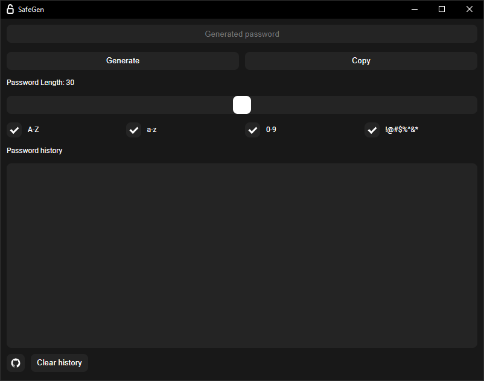

  <h1>SafeGen</h1>

A simple Rust-based password generator creating strong, secure passwords endlessly for optimal security.  

  

### Prequisets
`rustup target add wasm32-unknown-unknown`  
`cargo install trunk --locked`  
`cargo install tauri-cli --version "^2.0.0" --locked`  

### Testing
`cargo tauri dev`

### Building
`cargo tauri build`
